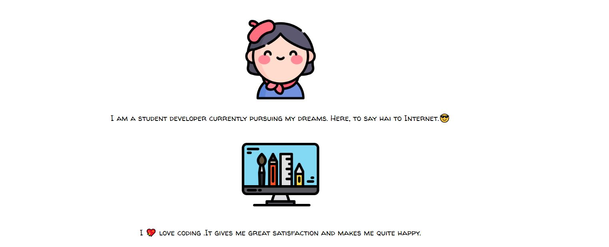

### [Connect with me 💬](https://voldemort18.github.io/Website/)

  

  

 

  

  

  

  Hola people!! Welcome to my GitHub Page. I am Swarnamuhi Kannan an AI student, I like working on new projects and super excited to work on ML , DL , Image processing and NLP based projects.
  

  
## My favorite tools and technologies ⚙️

  > Tools and technologies that I have worked with and am interested in
  <table>
    <tr>
      <td align="center" width="96">
        
         Python
      </td>
<td align="center" width="96">
        
         Java
      </td>
      <td align="center" width="96">
        
         C++
      </td>
      <td align="center"  width="96">
          
         HTML
      </td>
    <td align="center" width="96">
          
         Javascript
      </td>
      <td align="center" width="96">
          
         CSS
      </td>
      <td align="center" width="96">
      
     PostgreSQL
      </td>
   <tr>
   </tr>
  </table>

## GitHub Profile Trophy 🏆

